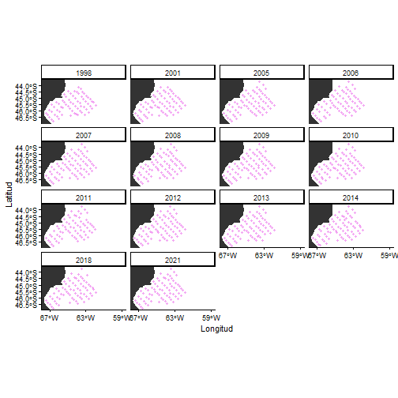
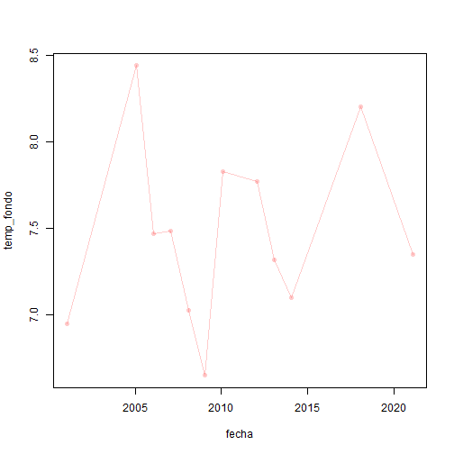
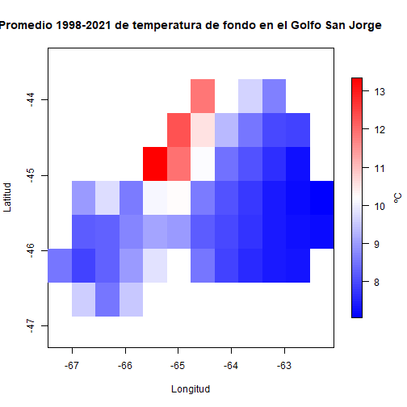
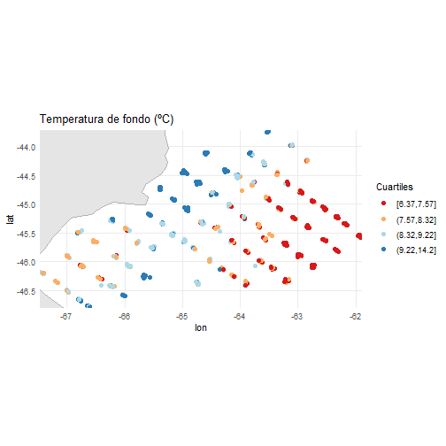
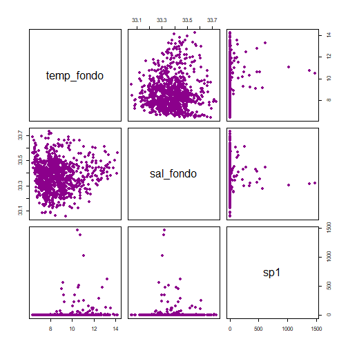
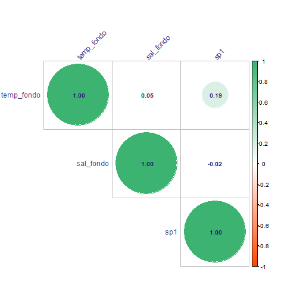
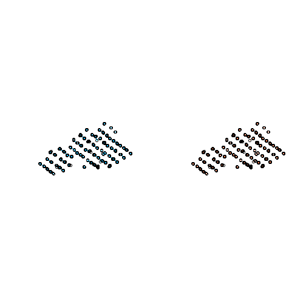
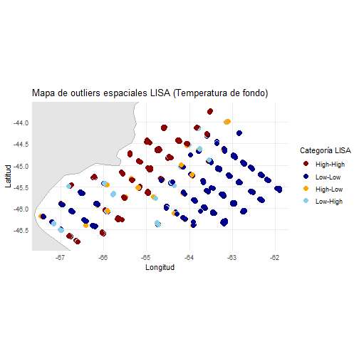

``` r
require(dplyr)
require(ggplot2)
require(kableExtra)
```

Para esta evaluación, utilicé una serie de datos provenientes de campañas de investigación realizadas por el INIDEP en el Golfo San Jorge (45 - 47 ºS), entre **1998-2021**. Las variables a trabajar incluyen:

fecha de registro de las varibles, coordenadas de donde provienen las mediciones (lon y lat), temperatura y salinidad de fondo (medidas *in situ*, utilizando un CTD) y la captura de una especie (lance de pesca realizado con red de arrastre de fondo), expresada en kg h-1.

## Carga de datos y exploración inicial.

#### Se explora su estructura para asegurar que cada variable presente la clase correcta


``` r
library(readxl)
datos <- read_excel("curso GSJ3.xlsx")
str(datos)
```

```
## tibble [988 × 6] (S3: tbl_df/tbl/data.frame)
##  $ fecha     : POSIXct[1:988], format: "2001-01-13" "2001-01-24" "2001-01-22" "2001-01-16" ...
##  $ lon       : num [1:988] -65.6 -62.3 -64.1 -64.5 -63.6 ...
##  $ lat       : num [1:988] -46.3 -45.2 -44.5 -46 -44.3 ...
##  $ temp_fondo: num [1:988] 9.31 6.53 10.02 7.87 8.66 ...
##  $ sal_fondo : num [1:988] 33.2 33.6 33.5 33.6 33.3 ...
##  $ sp1       : num [1:988] 0 0 0 0 0 0 0 0 0 0 ...
```

#### Se estable el formato `as.Date` para la columna fecha


``` r
datos$fecha<- as.Date(datos$fecha,format="%Y-%m-%d")
str(datos)
```

```
## tibble [988 × 6] (S3: tbl_df/tbl/data.frame)
##  $ fecha     : Date[1:988], format: "2001-01-13" "2001-01-24" "2001-01-22" "2001-01-16" ...
##  $ lon       : num [1:988] -65.6 -62.3 -64.1 -64.5 -63.6 ...
##  $ lat       : num [1:988] -46.3 -45.2 -44.5 -46 -44.3 ...
##  $ temp_fondo: num [1:988] 9.31 6.53 10.02 7.87 8.66 ...
##  $ sal_fondo : num [1:988] 33.2 33.6 33.5 33.6 33.3 ...
##  $ sp1       : num [1:988] 0 0 0 0 0 0 0 0 0 0 ...
```

#### Se crea una nueva variable extrayendo el Año de la columna fecha


``` r
library(lubridate)

datos2 <- datos|>
  mutate(anio = year(fecha))
```

#### Se grafican los lances para ubicarlos espacialmente, en cada año de la serie estudiada. Para ello, primero se crea un objeto espacial


``` r
library(sf)
datos2_sf <- datos2|>
   st_as_sf( coords = c( "lon", "lat" ), crs = 4326 )
```

#### Y se grafican


``` r
ggplot(datos2_sf) +
  geom_sf(size = 0.9, alpha=0.6,color="violet") +
  ylab("Latitud")+
  xlab("Longitud")+
  scale_x_continuous(limit = c(-67.5,-59), breaks=seq(-67,-59, 4))+
  annotation_map(map_data("world"))+
  theme_classic()+
  facet_wrap( ~ anio, ncol = 4)
```



#### Los datos provienen de una campaña con un diseño de muestreo en transectas, que mantiene una alta consistencia espacial a lo largo de los años. Eso permitiría estudiar las tendencias en un punto particular de la transecta. Entonces, a continuación se explora visualmente la ubicación de todos los registros de la serie. Se hace uso del paquete `mapview`, para sacar provecho de sus características interactivas (ej., modificar el zoom, obtener información de cada registro indivual)


``` r
library(terra)
library(mapview)

mapview::mapview(datos2_sf, label=datos2_sf$anio)
```

```
## Error in loadNamespace(name): no hay paquete llamado 'webshot'
```

## Análisis temporal

#### Para estudiar la tendencia temporal de la temperatura de fondo, se seleccionan del set de datos aquellos registros agrupados entre -46.5; 46.31 ºS y -63.5; -63 ºO. Estos límites espaciales se obtienen con relativa facilidad a partir del mapa realizado con mapview.


``` r
puntos<- datos2|>
  filter(lat > -46.5 & lat < - 46.31)|>
    filter (lon > -63.5 & lon < -63)|>
      select(fecha, temp_fondo)
```

```
## Error: unable to find an inherited method for function 'select' for signature 'x = "tbl_df"'
```

``` r
print(puntos)
```

#### Ahora se grafica la serie de tiempo de temperatura de fondo la zona antes delimitada


``` r
plot(puntos, type = "o", pch = 16, col = rgb(1, 0, 0, 0.2))
```



#### Se aplica un suavizado con promedios móviles utilizando la función `cma()`. Observar la tendencia con cuidado, considerando que está compuesta por n = 12, en el intervalo 1998-2021


``` r
library(smooth)

puntos1<-puntos

sm <- cma(puntos1$temp_fondo, order = 12)
puntos1$sm <- sm$fitted

plot(puntos1$fecha, puntos1$temp_fondo, type = "b", pch = 16, col = rgb(1, 0, 0, 0.2),
     xlab = "Año", ylab = "temperatura de fondo (°C)")
lines(puntos1$fecha, puntos1$sm, lwd = 2)
```


#### A continuación, se explora la tendencia media anual de la temperatura de fondo, en toda la serie estudiada para toda el área


``` r
# promedio anual

datos2

temp_anual <- aggregate(datos2$temp_fondo, by = list(anual = datos2$anio), mean)

print(temp_anual)


plot(temp_anual$anual, temp_anual$x, xlab = "Año", ylab = "temperatura de fondo (°C)", type = "b")
```


#### Sólo a los fines didácticos, se explora la misma variable empleando el paquete `raster`, ya que se renoce que la resolución espacial empleada para las cuadrículas en este caso, se definió para generar contiguidad entre ellos, pero excede la resolución espacial de la medición in situ original.


``` r
library(terra)
library(sp)
library(raster)

datos3<-datos2 #para no sobreescribir a datos2, que lo voy a utilizar más adelante nuevamente.

coordinates(datos3) <- ~lon + lat


  # Define extent based on your data or a larger area
    e <- extent(min(datos3$lon), max(datos3$lon), min(datos3$lat), max(datos3$lat))
    
    # Create an empty raster with desired resolution (e.g., 0.1 degrees)
    r <- raster(e, resolution = 0.45) 

       raster_grid <- rasterize(datos3, r, field = "temp_fondo", fun = mean)
       
       mis_colores <- colorRampPalette(c("blue", "white", "red"))(100)
       
     plot(raster_grid,
     main = "Promedio 1998-2021 de temperatura de fondo en el Golfo San Jorge",
     xlab = "Longitud", 
     ylab = "Latitud",
     col = mis_colores,  # Paleta de colores
     axes = TRUE,                # Mostrar ejes
     box = FALSE,                # Quitar caja
     legend = TRUE,              # Mostrar leyenda
     legend.width = 1.2,         # Ancho de leyenda
     legend.shrink = 0.8,        # Reducir tamaño leyenda
     legend.args = list(text = 'ºC', side = 4, line = 2.5))
```



## Análisis preliminares de estadística espacial

#### Primero, se grafica la distribución espacial de los cuartiles para los valores de temperatura de fondo


``` r
ggplot(datos2, aes(x = lon, y = lat)) +
  borders("world", xlim = range(datos2$lon), ylim = range(datos2$lat),
          fill = "gray90", colour = "gray70") +
  geom_point(aes(color = cut_number(temp_fondo, n=4)), size = 2 ) +   # 4 cuartiles
  scale_color_brewer(palette = "RdYlBu", name = "Cuartiles") +
  coord_sf(xlim = range(datos2$lon), ylim = range(datos2$lat), expand = FALSE) +
  theme_minimal() +
  labs(title = "Temperatura de fondo (ºC)")
```



### Numéricamente:


``` r
# Calculo de los cuartiles
quantile(datos2$temp_fondo, probs = seq(0, 1, 0.25))
```

```
##        0%       25%       50%       75%      100% 
##  6.373820  7.568352  8.318835  9.220475 14.222350
```

#### A continuación, se evalúan las correlaciones entre temperatura de fondo, salinidad de fondo y la captura de sp1


``` r
(cor_mat <- cor(datos2[,4:6])) # Matriz de correlaciones
```

```
##            temp_fondo   sal_fondo         sp1
## temp_fondo 1.00000000  0.04866878  0.18716924
## sal_fondo  0.04866878  1.00000000 -0.01744407
## sp1        0.18716924 -0.01744407  1.00000000
```

#### Se explora visualmente la distribución de los puntos al relacionar las variables, en gráficos de dispersión.


``` r
# Gráficos de dispersión
pairs(datos2[,4:6], pch=19, col="darkmagenta")
```



#### Para facilitar la intepretación, se representan los resultados de la matriz de correlaciones utilizando la función `corrplot()`. Se observa que todas las correlaciones son neutras o positivas, y de baja magnitud, siendo la de mayor valor la observada entre la temperatura de fondo y la captura de sp1, de 0,19.


``` r
# Visualización con corrplot
library(corrplot)
corrplot(cor_mat, method = "circle", type = "upper",
         col = colorRampPalette(c("orangered", "white", "mediumseagreen"))(200),
         tl.col = "darkslateblue", tl.srt = 45, 
         addCoef.col = "midnightblue", number.cex = 0.8)
```



#### Se explora espacialmente la correlación antes mencionada. Las capturas con valores más altos (de baja frecuencia) se observan en las zonas de mayor temperatura.


``` r
ggplot(datos2, aes(x = lon, y = lat)) +
  borders("world", fill="gray90", colour="gray70") +
  geom_point(aes(size = sp1, color = temp_fondo), alpha = 0.6) +
  scale_color_viridis_c() +
  coord_sf(xlim = range(datos2$lon), ylim = range(datos2$lat)) +
  theme_minimal()
```


## Dependencia espacial

#### Se analiza la presencia de depencia espacial. Se exploran dos métodos: Vecinos por distancia, estableciendo un radio de 0.25 grados y k vecinos más cercanos, estableciendo un número de dos.


``` r
library(spdep)
# Matriz de coordenadas
coords <- cbind(datos2$lon, datos2$lat)

# Distancia (radio = 0.25 grados aprox.)
nb_dist <- dnearneigh(coords, 0,0.25)

# knn (2 vecinos)
nb_knn <- knn2nb(knearneigh(coords, k=2))


par(mfrow=c(1,2))
plot(nb_dist, coords, main="Vecinos por distancia", col="deepskyblue")
plot(nb_knn, coords, main="Vecinos k-NN (k=2)", col="coral")
```



#### Finalmente, se calcula una matriz de pesos (continuando con el método de k vecinos más cercanos), que permite detectar patrones espaciales. A continuación, se calcula el índice de Moran. Este índice indica si los valores de una variable están agrupados, dispersos o distribuidos al azar, comparando cada valor con los de sus vecinos. Para ver los patrones de agrupación local se utiliza el Indicador Local de Asociación de Moran (LISA):


``` r
W <- nb2listw(nb_knn, style = "W")

# Moran's I
lisa <- localmoran(datos2$temp_fondo, W)
```

### Se realiza el gráfico para ver los outliers espacialmente


``` r
# Etiquetas tomando como referencia a la media
datos2$lisa_cat <- NA
ref_val <- mean(datos2$temp_fondo)

for (i in 1:nrow(datos2)) {
  if (datos2$temp_fondo[i] >= ref_val & lisa[i,1] > 0) {
    datos2$lisa_cat[i] <- "High-High"
  } else if (datos2$temp_fondo[i] < ref_val & lisa[i,1] > 0) {
    datos2$lisa_cat[i] <- "Low-Low"
  } else if (datos2$temp_fondo[i] >= ref_val & lisa[i,1] < 0) {
    datos2$lisa_cat[i] <- "High-Low"
  } else if (datos2$temp_fondo[i] < ref_val & lisa[i,1] < 0) {
    datos2$lisa_cat[i] <- "Low-High"
  }
}

datos2$lisa_cat <- factor(datos2$lisa_cat,
                            levels = c("High-High","Low-Low","High-Low","Low-High"))

# Gráfico
xlim <- range(datos2$lon) + c(-0.2, 0.2)
ylim <- range(datos2$lat) + c(-0.2, 0.2)

ggplot(datos2, aes(x = lon, y = lat)) +
  borders("world", xlim = xlim, ylim = ylim,
          fill = "gray90", colour = "gray70") +
  geom_point(aes(color = lisa_cat), size = 3) +
  scale_color_manual(values = c(
    "High-High" = "darkred",
    "Low-Low"   = "darkblue",
    "High-Low"  = "orange",
    "Low-High"  = "skyblue"
  )) +
  coord_sf(xlim = xlim, ylim = ylim, expand = FALSE) +
  theme_minimal() +
  labs(title = "Mapa de outliers espaciales LISA (Temperatura de fondo)",
       x = "Longitud", y = "Latitud",
       color = "Categoría LISA")
```


